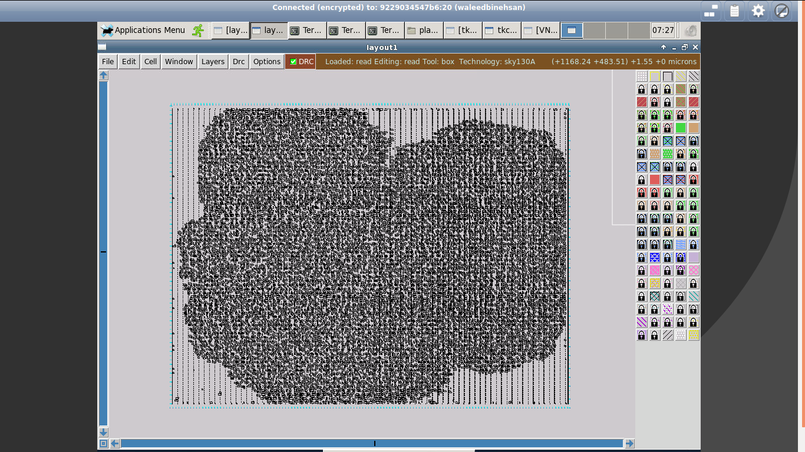

# This repository is the submission or Physical design course

## Skills learned

### Day 1: 
* Introduction to RISCV ISA
* Introduction OpenLANE
* Sky130 PDK

### Day 2:
* Core concepts of floor planing
    * Utilization factor and aspect ratio
    * Power Planning
    * Macro's wire and capacitance estimation
    * Floor Planning
    * Need of libraries and characterization
    * Congestion aware placement


___
## Day 1:
* RISCV is an open-source ISA by UC-Berkley
* OpenLANE is a complete RTL to GDSII flow by efables. It uses the following tools for the flow
    * Yosys & abc -> Synthesis
    * OpenSTA -> Static timing analysis
    * Fault -> DFT
    * OpenROAD App
        * Floorplanning
        * Placement
        * CTS (Clock tree synthesis)
        * Global routing
    * Custom scripts -> Antenna diode insertion
    * Yosys for a pre-routing LEC (Logical equivalance check)
    * TritonRoute -> Detailed Routing
    * RC extraction
    * OpenSTA again for a post routing timing analysis
    * Magic -> DRC (Design rule check and physical verification)
* Sky130 PDK

Sky130 PDK is an open-source PDK (Process Design Kit) by SkyWater and Google this is based on 130nm technology node.

**Day: 1 Task** In day-1 task we had to synthesis a design *picorv32a* by using OpenLANE in interactive mode.

Open up OpenLANE on your personal machine or on *Lab Instance*.
If you are on your personal machine you need to go into docker by using the following command:

```
    sudo docker run -it -v $(pwd):/openLANE_flow -v $PDK_ROOT:$PDK_ROOT -e PDK_ROOT=$PDK_ROOT -u $(id -u $USER):$(id -g $USER) openlane:rc4
```

Once in the docker make sure you are in the right directory then, go to interactive mode by using the following command

```
    ./flow.tcl -interactive
```

Include the package by using the following command

```
    package require openlane 0.9
```

After that you need to prepare your design files. In my case the design name was picorv32a the command I wrote was

```
    prep -design ./designs/picorv32a
```

After when the design is prepared run syntheis by using the following command

```
    run_synthesis
```

And I got the results as shown below.


---

## Day 2:
### Utilization factor
 It's the number of cells used by the design divided by
 the total number of cells availabe on the core. For example if you have a utilization factor of 1, that means we are using the complete core. In a typical design the utilization factor is about 0.65-0.75

 ### Aspect ratio
 Its the width of the core to the length of the core. This factor basically tells what is the shape of the core. For example if aspect ratio of the core is 1, that means the core is square shaped

 ### Power planing
 Power planning is an extremely import step in floor planning. If we have poor power planning when a array of gates try to go from 0-1 they draw too much current from the source. This causes a voltage drop of the source voltage. Similarly when the array is chaning from 1-0 they release this charge causing the source voltage to rise. One way to tackle this problem is by decoupling capacitors.
* We connect a capacitor in parallel from to a bigger combinatorial block this decouples the hardware from the source. Hence the name decoupling capacitor
    * When there is a high demand the capacitor provides this voltage
    * When there is a release of charge these capacitors take that charge keeping the noise in the voltage source as minimum as possible

These huge chunk of blocks are using quite alot in the design. So, we make then into macro's.

But when multiple macro's are connected together the inter-connect also need to supply voltage. This is done by having a grid of voltage and ground placed across the core, as shown in the fig.


### Floor placement:
In order to place the standard cells at their respective place. We need to run placement on the synthesised design.
This can be done by the following command
```
run_placement
```
After placment a def-file is made in the floor plan directory.
This can be opened using magic by the following command.
```
magic -T <Tech file path> lef read <LEF file path> def read <DEF file path>
```
The view after running opening the def in magic is as follows


There are multiple types of timings that a circuit needs to hold, these timing information is covered in .lib file.